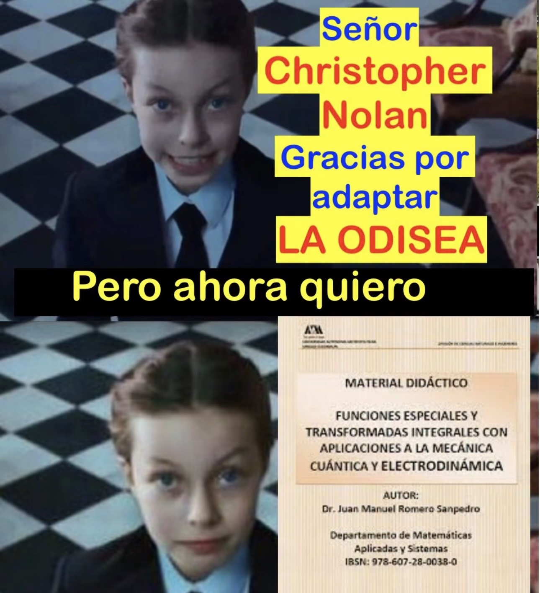

I'm a physicist student at UNAM. My current interests are electrodynamics.

- 📚📝 I’m currently in my **fifth semester of university (2027 - 1)**
  
- 🐍 I’m currently learning **Python**

- 🌎 I’m looking to collaborate on **Student Chapter**

- ⚡ Fun fact **I like to do experimental physics and mathematics proofs**

 

 
[emilianomateos.github.io](https://EmilianoMateos.github.io) · [jorgeemilianogams@ciencias.unam.mx](mailto:jorgeemilianogams@ciencias.unam.mx)
 

 

